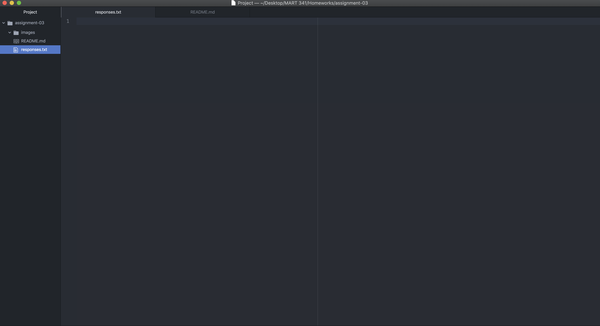

# Assignment 3
## Jeffrey Hyer

Three things I've learned so far:
1. How to bold and italic text in markdown
2. What IP addresses and Domain Naming Systems are
3. How the internet communicates information

Here is a [link](https://www.kayak.com) to a website I use frequently using its absolute URL

Here is a [link](./responses.txt) to my responses.txt using its relative URL

Here is an embedded image of my screenshot using its relative URL:

