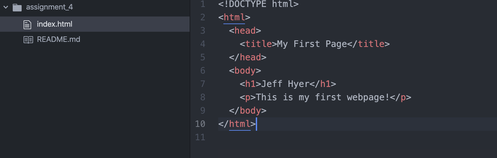

A browser's main function is to request data from a server and display it in the browser window you are using. For webpages, that data it is searching for and displaying is an html document. It can also search for PDFs, images, videos, etc. The browser I primarily use is Safari.

Markup language is essentially the text that computers 'read and translate' in order to display a document. Computers and browsers do not show the actual markup language, instead, they should the page that the markup language is saying to show. One commonly used in development is html because it is a widely used and standardized language used too display content on web browsers. 

Here is an embedded image of my screenshot using its relative URL:

