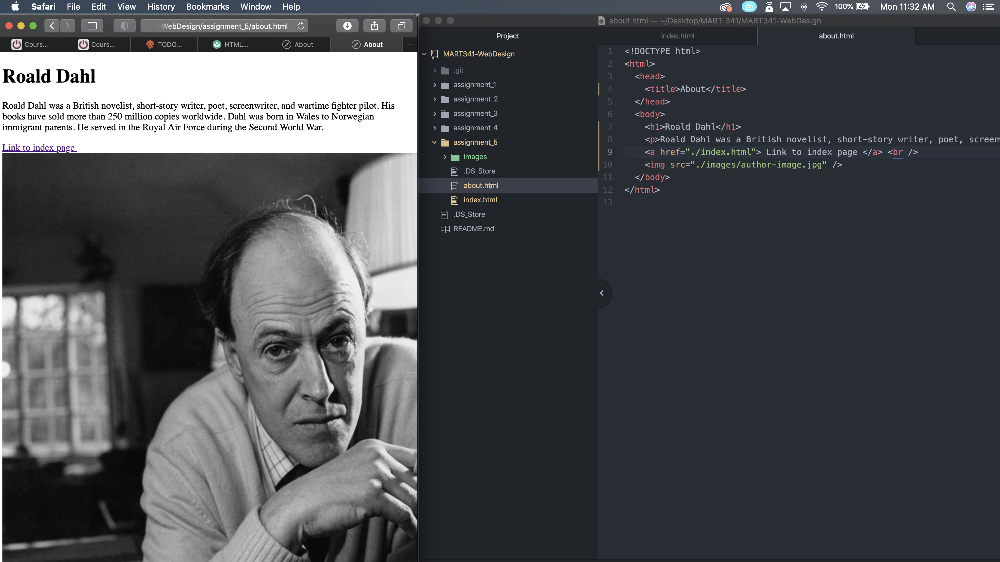

On Wayback Machine, I looked up a webpage for H&M from 2009. I chose to lookup a clothing company site to see not only the dated website, but also the dated fashion. Although I couldn't see any images of clothing, I was able to see the old structure of the website. It was very simple and straightforward, and didn't have a lot of tabs to choose from (compared to what it offers now). The page is small, and the home page is just a list of countries for users to choose from. There weren't any ordering options or much imagery.

Something I learned from this last assignment was how to update my work and have it upload directly to the internet. I also learned how to link page together (it took me a while to figure out the exact path needed for the link). It's becoming more clear to me how websites work and how data is retrieved by internet browsers. 

Here is an embedded image of my screenshot using its relative URL:

